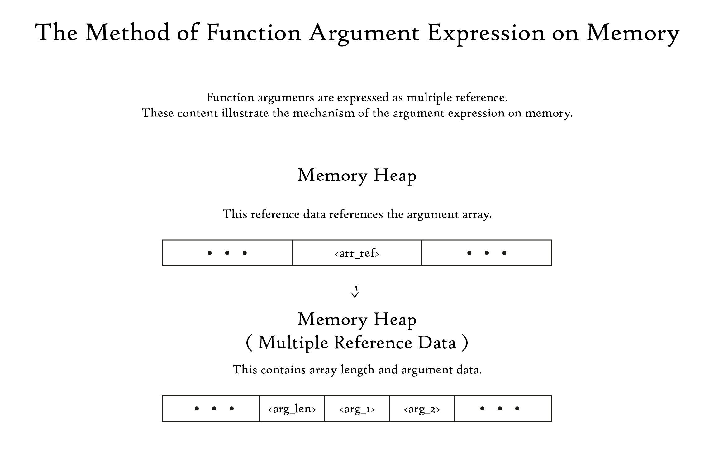

# CVM 概要

[ドキュメント](../../../../../index.md) > [日本語](../../../../index.md) > [仕様書](../../../index.md) > [CVM](../../index.md) > [メモリ管理](../index.md) > [CVM 概要](./index.md)

## 概要

CVM についての大まかな解説を行う。

## メモリ領域

- 共有領域 ... すべてのスレッドに共有される領域
    - 命令領域 ... 命令データを格納する領域
    - 関数領域 ... 関数データを格納する領域
    - クラス領域 ... クラスデータを格納する領域
    - 定数領域 ... 定数データを格納する領域
    - 参照領域 ... 新規 / 長期データ領域内データの参照を格納する領域
    - GC 領域 ... GC 対象のデータを格納する領域
        - 新規 GC 領域 ... 比較的新しい変数データを格納する領域
            - 第一新規 GC 領域
            - 第二新規 GC 領域
        - 長期 GC 領域 ... 寿命の長いデータを格納する領域
- スレッド領域 ... それぞれのスレッドに共有される領域
    - 関数領域 ... 関数の実行に関するデータを格納する領域
    - 演算領域 ... 演算データを格納する領域

## 演算

### 基本演算

四則演算や論理演算などの基本演算について解説する。

1. 演算スタックに演算元データの参照をプッシュ
2. 演算命令を実行
    1. 演算スタック内の参照データを取得かつポップ
    2. 演算スタックに演算結果をプッシュ

### 関数

#### 呼び出し

1. 演算スタックに関数呼び出しデータ ( 関数 ID, 引数データ )をプッシュ
2. `call` 命令を実行
    1. 演算スタック内の関数呼び出しデータを取得かつポップ
    2. 関数スタックに関数データをプッシュ
3. 呼び出し完了後は関数内の命令を実行

##### 引数データ

引数データは引数列を表すが、実際には各引数の複数参照値である。



#### 値返却

1. 演算スタックに返り値をプッシュ
2. `ret` 命令を実行
    1. 呼び出し元関数に向けて演算スタックに返り値をプッシュ
    2. 関数スタックから関数データをポップ

## 命令例

```
class Hello

@entry(str[] args)
    println("Hello, world!")
end
```

```
; マジックナンバ
GANTCCBC

; 関数定義
<entry_func_id> Hello.@entry(str[])

; Hello.@entry(str[]) の命令

spush_str   "Hello, world!"
spush_uuid  <println_func_id>
call
ret
```

---

Copyright © 2019-2021 Garnet3106 All rights reserved.
